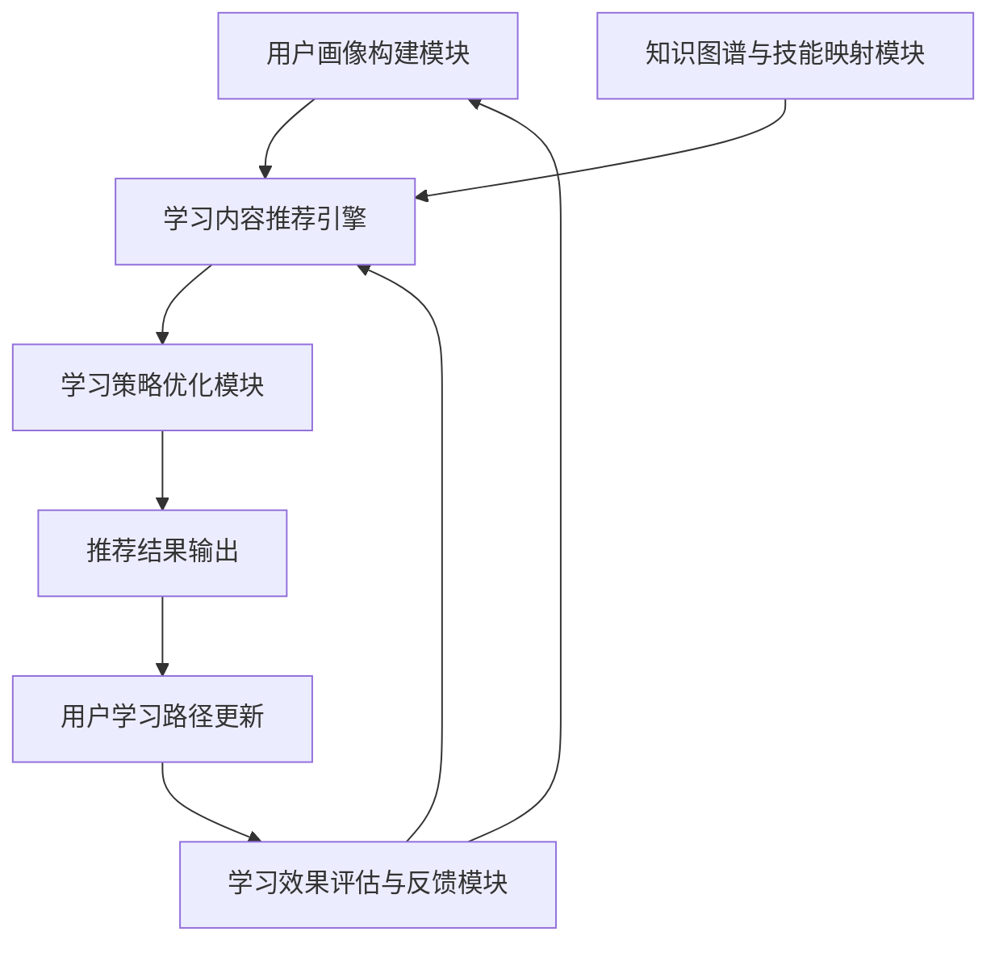
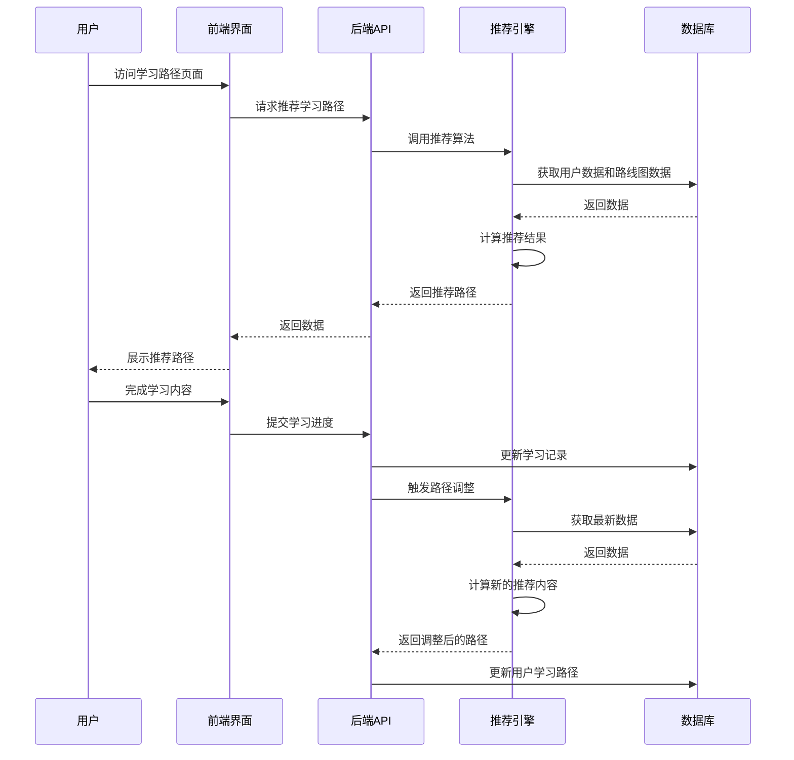

# 智能自适应学习路径推荐算法设计文档

## 1. 算法概述

### 1.1 算法目标

设计并实现一个智能自适应学习路径推荐算法，根据学习者的个体特征、学习进度、知识掌握程度及学习目标，动态调整并推荐最适合的学习顺序及策略，从而提高学习效率和学习体验。

### 1.2 核心价值

- **个性化推荐**：根据学习者特征和学习历史提供定制化学习路径
- **自适应调整**：实时根据学习表现调整难度和内容
- **高效学习**：优化学习顺序，减少无效学习时间
- **学习策略优化**：提供适合不同学习风格的学习方法建议
- **知识图谱构建**：建立知识点之间的关联，确保学习的连贯性和系统性

## 2. 算法架构设计

### 2.1 总体架构

智能自适应学习路径推荐算法由以下五个核心模块组成：

1. **用户画像构建模块**
2. **知识图谱与技能映射模块**
3. **学习内容推荐引擎**
4. **学习策略优化模块**
5. **学习效果评估与反馈模块**

### 2.2 模块关系图

## 3. 数据模型设计

### 3.1 现有数据模型利用

- **LearningRecord**：学习记录，包含学习时长、完成状态等
- **PracticeRecord**：练习记录，包含练习成绩、用时等
- **UserLearningPath**：用户学习路径，包含当前进度、完成状态等
- **RoadmapTemplate**：路线图模板，作为推荐算法的基础
- **RoadmapStage**：路线图阶段，定义学习内容的组织结构
- **UserPathStage**：用户路径阶段进度，记录用户在各阶段的学习情况

### 3.2 新增数据模型

1. **LearningStyle**：用户学习风格模型
2. **KnowledgeMastery**：知识点掌握度模型
3. **LearningRecommendation**：学习推荐记录模型
4. **LearningPreference**：学习偏好设置模型

## 4. 算法核心实现

### 4.1 用户画像构建算法

**输入**：用户基础信息、历史学习记录、练习成绩、交互数据
**输出**：用户画像（包含学习风格、知识掌握度、学习偏好等）
**算法流程**：
1. 收集用户基础信息和历史数据
2. 分析学习行为模式，确定学习风格
3. 评估知识点掌握程度
4. 提取学习偏好特征
5. 构建完整用户画像

### 4.2 初始路线图推荐算法

**输入**：用户画像、学习目标、专业选择
**输出**：初始学习路线图
**算法流程**：
1. 基于用户专业和难度偏好筛选候选路线图
2. 计算每个路线图与用户画像的匹配度
3. 考虑用户学习目标的权重
4. 应用协同过滤，参考相似用户的成功路径
5. 生成并排序推荐路线图列表

### 4.3 动态学习内容推荐算法

**输入**：当前学习进度、知识点掌握度、学习行为数据
**输出**：下一个推荐学习内容
**算法流程**：
1. 分析当前学习阶段的完成情况
2. 基于知识图谱，确定可学习的下一步内容
3. 考虑知识点依赖关系和学习难度梯度
4. 根据掌握度调整推荐内容的难度
5. 生成个性化的内容推荐列表

### 4.4 学习策略优化算法

**输入**：学习风格、学习行为数据、学习目标
**输出**：学习策略建议
**算法流程**：
1. 基于学习风格选择适合的学习方法
2. 分析学习效率，优化学习时间分配
3. 生成个性化的学习建议和提示
4. 推荐适合的辅助学习资源

### 4.5 学习效果评估算法

**输入**：练习成绩、学习时长、完成率、知识点掌握度变化
**输出**：学习效果评估报告
**算法流程**：
1. 综合评估各项学习指标
2. 识别学习瓶颈和薄弱环节
3. 预测学习效果和完成时间
4. 生成学习改进建议

## 5. 与系统其他模块的联动机制

### 5.1 与后端数据库表的集成

1. **现有表的扩展利用**：
   - LearningRecord：用于提取学习行为数据
   - PracticeRecord：用于评估知识掌握度
   - UserLearningPath：用于存储和更新推荐的学习路径
   - RoadmapTemplate/RoadmapStage：提供基础路线图数据
   - UserPathStage：记录推荐内容的学习进度

2. **新增表的关联关系**：
   - LearningStyle与User表一对一关联
   - KnowledgeMastery与User和Book/Chapter多对多关联
   - LearningRecommendation与UserLearningPath和RoadmapStage关联

### 5.2 与API视图的集成

1. **现有视图集的扩展**：
   - 扩展RoadmapTemplateViewSet，增加智能推荐功能
   - 扩展UserLearningPathViewSet，集成动态路径调整
   - 扩展PracticeRecordViewSet，增加学习效果反馈机制

2. **新增API端点**：
   - 学习风格评估接口
   - 知识掌握度分析接口
   - 个性化学习建议接口

### 5.3 与前端功能的交互

1. **路线图推荐界面**：展示个性化推荐的学习路线
2. **学习路径页面**：展示动态调整的学习内容
3. **学习仪表盘**：显示学习效果评估和建议
4. **学习风格设置**：允许用户调整学习偏好

### 5.4 数据流依赖关系

## 6. 技术实现要点

### 6.1 算法技术选型

- **机器学习算法**：
  - 协同过滤（Collaborative Filtering）
  - 内容基础的推荐（Content-based Filtering）
  - 混合推荐系统
  - 知识图谱推理

- **数据分析技术**：
  - 特征工程
  - 聚类分析
  - 知识图谱构建
  - 学习行为序列分析

### 6.2 性能优化策略

- 推荐算法计算结果缓存
- 批量处理学习数据更新
- 异步计算复杂推荐逻辑
- 数据预加载和预计算

### 6.3 扩展性设计

- 模块化的算法架构
- 可插拔的推荐策略
- 支持自定义学习风格模型
- 灵活的知识图谱配置

## 7. 开发与实施计划

### 7.1 开发流程

1. **阶段一：数据模型扩展**（1-2周）
   - 设计并实现新增数据模型
   - 创建数据库迁移
   - 更新相关序列化器

2. **阶段二：算法核心实现**（2-3周）
   - 实现用户画像构建算法
   - 实现初始路线图推荐算法
   - 实现动态学习内容推荐算法
   - 实现学习策略优化算法

3. **阶段三：API接口开发**（1-2周）
   - 扩展现有视图集
   - 实现新增API端点
   - 编写API文档

4. **阶段四：与前端集成**（1-2周）
   - 配合前端开发推荐界面
   - 进行端到端测试
   - 优化用户体验

5. **阶段五：测试与优化**（1-2周）
   - 性能测试
   - A/B测试推荐效果
   - 算法参数调优

### 7.2 测试策略

- 单元测试：算法核心功能测试
- 集成测试：API接口和数据库交互测试
- 性能测试：推荐计算性能和响应时间
- 用户测试：收集真实用户反馈，优化推荐质量

## 8. 监控与维护

### 8.1 关键指标监控

- 推荐点击率
- 学习路径完成率
- 学习效果提升度
- 用户满意度

### 8.2 异常处理机制

- 数据异常检测和修复
- 算法故障恢复策略
- 性能降级方案

### 8.3 版本迭代计划

- 持续收集用户反馈
- 定期更新算法模型
- 引入新的推荐策略

## 9. 风险评估与应对

### 9.1 潜在风险

- 冷启动问题：新用户数据不足
- 数据稀疏性：部分知识点学习记录少
- 推荐质量评估难度
- 系统性能压力

### 9.2 应对策略

- 基于规则的初始推荐
- 内容相似度补充
- 多维度评估推荐效果
- 性能优化和缓存机制

## 10. 总结与展望

智能自适应学习路径推荐算法将显著提升用户学习体验和学习效果。通过个性化推荐和动态调整，学习者可以获得最适合自己的学习内容和策略。随着数据积累和算法优化，推荐质量将持续提升，为用户提供更加智能化的学习支持。

## 11. 可视化优化实现

### 11.1 前端UI增强

1. **智能推荐标识**
   - 在路线图卡片上添加「智能推荐」徽章和星星图标
   - 使用醒目的视觉设计突出推荐内容，提升用户感知
   - 实现动态加载动画，优化用户等待体验

2. **匹配度可视化**
   - 设计动态进度条展示路线图与用户画像的匹配度
   - 使用渐变色效果直观表示匹配程度
   - 添加数值百分比显示，增强透明度

3. **个性化推荐理由展示**
   - 在每个推荐卡片下方显示定制化的推荐理由
   - 根据学习风格动态生成不同的推荐文案
   - 使用清晰的排版和强调样式提升可读性

4. **用户画像摘要**
   - 设计用户画像摘要组件，展示学习风格、知识水平和兴趣方向
   - 使用简洁的标签云形式呈现用户特征
   - 提供可视化的学习进度概览

### 11.2 后端功能优化

1. **增强推荐API**
   - 更新`recommend_roadmap`方法，返回更丰富的推荐信息
   - 添加`is_recommended`、`matching_score`、`recommendation_reason`等字段
   - 实现个性化特征标签生成功能

2. **智能推荐理由生成**
   - 开发`_generate_recommendation_reason`方法，根据学习风格动态生成推荐理由
   - 针对不同学习风格（视觉型、听觉型、读写型、动手型）提供定制化文案
   - 考虑知识掌握度和学习偏好因素，丰富推荐理由内容

3. **异步加载优化**
   - 实现推荐数据的异步加载机制
   - 添加加载状态管理和错误处理
   - 优化API响应速度，提升用户体验

### 11.3 前端实现细节

1. **组件实现**
   - 在`LearningPathView.vue`中实现智能推荐功能
   - 采用静态导入方式导入`httpGet`函数：`import { httpGet } from '../api/api.js'`
   - 实现`loadRecommendedRoadmaps`方法异步加载推荐数据

2. **API函数优化**
   - 在`api.js`中将`httpGet`函数修改为正确导出：`export async function httpGet(...)`
   - 确保函数可被前端组件正确导入和使用
   - 保留原有的请求头处理、路径拼接和错误处理逻辑

3. **智能错误处理机制**
   - 针对AUTH 401认证错误实现静默处理，避免在未登录状态下显示错误提示
   - 对其他API错误提供友好的用户通知
   - 优化错误处理条件判断顺序，确保代码结构一致性

4. **功能降级机制**
   - 实现API请求失败时的优雅降级，自动切换到带推荐属性的静态数据
   - 为静态数据添加`is_recommended: true`、`matching_score`和`recommendation_reason`字段
   - 确保在各种网络环境下都能提供良好的用户体验

### 11.4 技术实现亮点

1. **UI设计创新**
   - 实现渐变色阴影效果，增强视觉层次感
   - 设计响应式布局，适配不同设备尺寸
   - 使用微交互提升用户体验，如悬停效果和过渡动画

2. **数据可视化**
   - 使用CSS进度条展示匹配度，避免引入额外的可视化库
   - 实现平滑的动画过渡效果
   - 采用语义化HTML结构，确保可访问性

3. **性能优化**
   - 优化前端渲染性能，减少不必要的重绘
   - 实现数据缓存机制，减少重复请求
   - 使用懒加载技术，提升页面加载速度

4. **健壮性保障**
   - 完善的错误处理机制，确保系统稳定性
   - 优雅的功能降级策略，提升用户体验
   - 优化的数据加载流程，优先展示智能推荐内容

未来可以考虑引入更先进的机器学习模型，如深度学习和强化学习，进一步提高推荐的准确性和适应性。同时，也可以探索与其他教育技术的融合，如自然语言处理用于学习内容理解，计算机视觉用于学习行为分析等。